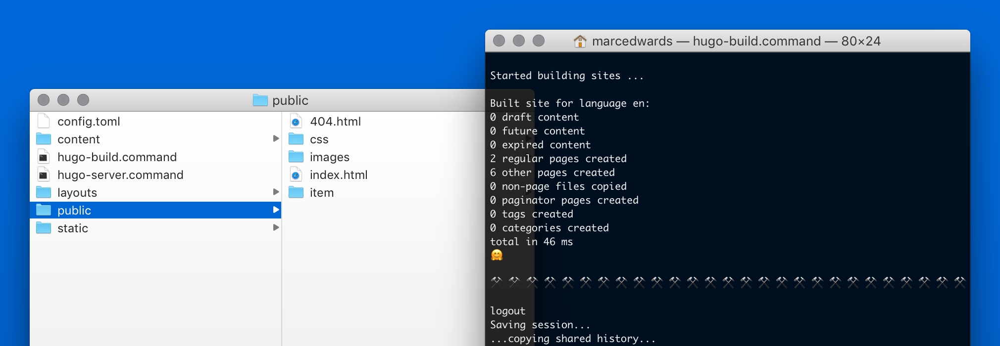

# Hugs

[Hugs](https://bjango.com/designresources/) is a super simple starting point for [Hugo](http://gohugo.io) websites.

Hugs is an entire, but mostly empty, Hugo project. It’s a good starting point, where the intention is to build a custom design. It contains no CSS, and only a tiny bit of HTML. However, it does include a fully set up folder structure, config.toml, partials, basic HTML templates, basic Markdown example posts, and scripts to build and run Hugo’s server.

Hugs is what I use for all new website projects that I am building using Hugo.

🤗

Hugs is free and open source, released under the [BSD license](https://github.com/bjango/Hugs/blob/master/Help/License.md).

**Download:** **[Hugs](https://github.com/bjango/Hugs/archive/master.zip)** — 1.0 ([version history](https://github.com/bjango/Hugs/blob/master/Help/Version%20History.md))

-----

### Help

1. [Install Hugo](http://gohugo.io/getting-started/quick-start/), if you haven’t done it already.
2. Download Hugs.
3. Unzip it, and copy the Hugs folder to where you want your new project (maybe rename the folder, too?).
4. Right click `hugo-build.command` and choose Open.
5. The project should build.

You can now edit `config.toml` and the contents to suit.

```
              :::::::::     :::::::       ::::        ::::    :::     ::::::::      :::::::: 
             :+:    :+:        :+:      :+: :+:      :+:+:   :+:    :+:    :+:    :+:    :+: 
            +:+    +:+        +:+     +:+   +:+     :+:+:+  +:+    +:+           +:+    +:+  
           +#++:++#+         +#+    +#++:++#++:    +#+ +:+ +#+    :#:           +#+    +:+   
          +#+    +#+        +#+    +#+     +#+    +#+  +#+#+#    +#+   +#+#    +#+    +#+    
         #+#    #+#    #+# #+#    #+#     #+#    #+#   #+#+#    #+#    #+#    #+#    #+#     
        #########      #####     ###     ###    ###    ####     ########      ######## 
```